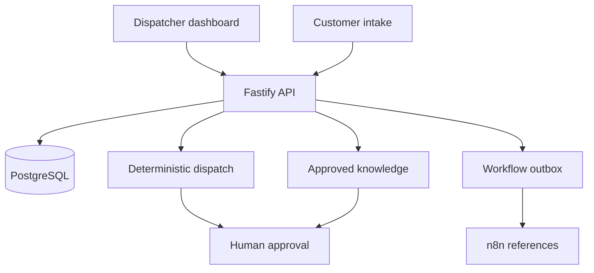

# Northstar HVAC Field Service Operations Platform

An executable reference product for an HVAC service business: customer intake, safety triage, transparent technician recommendations, human dispatch approvals, parts readiness, grounded service assistance, automations, analytics, and auditability.

> **Portfolio disclosure:** Northstar and every person, customer, work order, metric, and location shown here are fictional or synthetic. This repository is not evidence of a client engagement or production deployment.

## Product capabilities

| Area | Capability | Control boundary |
|---|---|---|
| Intake | Validated request and bilingual safety detection | Hazardous cases stop automation |
| Dispatch | Skill gate plus travel, parts, capacity, and quality scoring | Human makes final assignment |
| Assistant | Approved service articles with citations | No unsupported answer or hazard troubleshooting |
| Automation | Escalation, reminders, shortage review, follow-up | Idempotency and approval gates |
| Analytics | SLA, first-time-fix, repeat visits, travel, capacity | Decision support only |
| Audit | Actor, action, entity, timestamp, metadata | Admin-only API access |

## Architecture



The hosted dashboard is an interactive synthetic-data preview. The complete API and PostgreSQL stack run locally:

```bash
cp .env.example .env
npm ci
npm --prefix services/api ci
docker compose up --build
```

- Dashboard: `http://localhost:3000`
- API health: `http://localhost:4000/health`
- Demo email: `dispatcher@northstar.local`
- Local fallback password: `DispatchDemo!2026` (replace before shared use)

## Verification

```bash
npm run lint
npm run build
npm run typecheck:api
npm test
docker compose config --quiet
```

The suite contains **217 API/domain tests** plus dashboard build and structure tests. Coverage gates are 80% lines/functions/statements and 75% branches.

## Dispatch policy v1

Missing required skill makes a technician ineligible. Eligible candidates receive up to 35 travel, 25 parts, 20 capacity, and 20 first-time-fix points. Scores are clamped, deterministic, factor-explained, and stably ordered. These weights are explicit starting assumptions—not optimized or production-validated claims.

## Repository map

```text
app/                 interactive Vinext/React dashboard
services/api/        Fastify API, policy, guards, and tests
infra/postgres/      normalized schema, indexes, seed
automations/n8n/     inactive importable workflow references
docs/                architecture, API, security, testing, operations
.github/workflows/   web, API, coverage, audit, container CI
```

No real customer or technician data is included. Read [production readiness](docs/PRODUCTION_READINESS.md) before adaptation. MIT licensed.

---

## Vinext runtime notes

A clean full-stack starter running on [vinext](https://github.com/cloudflare/vinext), with optional Cloudflare D1 and Drizzle support.

## Prerequisites

- Node.js `>=22.13.0`
- Linux with `flock`, `curl`, and GNU `timeout`

## Sites Lifecycle

The Sites lifecycle CLI runs the locked dependency install before returning this checkout. Edit the source under `app/`, then checkpoint when a coherent milestone is ready to inspect or share. The remote Sites builder runs `npm run build` against the pushed commit. Do not repeat install or build as a normal pre-checkpoint step.

This starter does not use `wrangler.jsonc`.

`install:ci` is intentionally a single, non-retrying `npm ci`. It refuses a concurrent install for the same project, consumes a matching image-seeded npm cache with `--prefer-offline` while retaining registry fallback for a missing cache object, otherwise downloads and verifies the complete vinext tarball recorded in `package-lock.json`, limits npm to one socket, and terminates a stalled install. `build` applies a short timeout. These helpers target Linux and use GNU `timeout`; they are not native macOS scripts.

Scripts that need writable project-scoped home, npm, XDG, and temporary paths use `scripts/sites-env.sh`. The `dev` and `start` scripts honor the caller's runtime environment and keep Wrangler logs inside the checkout. The generated `.sites-runtime/` directory is disposable and ignored by Git.

## Included Shape

- edit site code under `app/`
- `app/chatgpt-auth.ts` provides optional dispatch-owned ChatGPT sign-in helpers
- `.openai/hosting.json` declares optional Sites D1 and R2 bindings
- `vite.config.ts` simulates declared bindings for local development
- `db/index.ts` reads the D1 binding from the Cloudflare Worker environment
- `db/schema.ts` starts intentionally empty
- `examples/d1/` contains an optional D1 example surface
- `drizzle.config.ts` supports local migration generation when needed

## Workspace Auth Headers

OpenAI workspace sites can read the current user's email from `oai-authenticated-user-email`.

SIWC-authenticated workspace sites may also receive `oai-authenticated-user-full-name` when the user's SIWC profile has a non-empty `name` claim. The full-name value is percent-encoded UTF-8 and is accompanied by `oai-authenticated-user-full-name-encoding: percent-encoded-utf-8`.

Treat the full name as optional and fall back to email when it is absent:

```tsx
import { headers } from "next/headers";

export default async function Home() {
  const requestHeaders = await headers();
  const email = requestHeaders.get("oai-authenticated-user-email");
  const encodedFullName = requestHeaders.get("oai-authenticated-user-full-name");
  const fullName =
    encodedFullName &&
    requestHeaders.get("oai-authenticated-user-full-name-encoding") ===
      "percent-encoded-utf-8"
      ? decodeURIComponent(encodedFullName)
      : null;

  const displayName = fullName ?? email;
  // ...
}
```

## Optional Dispatch-Owned ChatGPT Sign-In

Import the ready-to-use helpers from `app/chatgpt-auth.ts` when the site needs optional or required ChatGPT sign-in:

- Use `getChatGPTUser()` for optional signed-in UI.
- Use `requireChatGPTUser(returnTo)` for server-rendered pages that should send anonymous visitors through Sign in with ChatGPT.
- In a Server Component, start sign-in with `<a href={chatGPTSignInPath(returnTo)} target="_top">`. The auth helper module is server-only; do not import it into a Client Component.
- Do not use `fetch`, XHR, a client-side router, or a framework link that can prefetch the sign-in route. SIWC must start as a top-level navigation.
- Never request the AuthAPI authorization endpoint directly. The dispatch-owned `/signin-with-chatgpt` route must start the SIWC flow.
- Use `chatGPTSignOutPath(returnTo)` for browser sign-out links or actions.
- Pass a same-origin relative `returnTo` path for the destination after sign-in or sign-out. The helper validates and safely encodes it.
- Mark protected pages with `export const dynamic = "force-dynamic"` because they depend on per-request identity headers.

Dispatch owns `/signin-with-chatgpt`, `/signout-with-chatgpt`, `/callback`, the OAuth cookies, and identity header injection. Do not implement app routes for those reserved paths. Routes that do not import and call the helper remain anonymous-compatible.

SIWC establishes identity only; it does not prove workspace membership. Use the Sites hosting platform's access policy controls for workspace-wide restrictions, or enforce explicit server-side membership or allowlist checks.

Use SIWC for account pages, user-specific dashboards, saved records, and write actions tied to the current ChatGPT user. Leave public content anonymous.

## Diagnostic Commands

- `npm run install:ci`: perform the one bounded lockfile install
- `npm run dev`: start the Vite/Vinext development server
- `npm run build`: build the deployable Sites artifact
- `npm run start`: start the built Vinext application
- `npm test`: build and verify the rendered development-preview metadata
- `npm run db:generate`: generate Drizzle migrations after schema changes

Use build commands for targeted diagnosis after a remote failure, not as part of the normal checkpoint path.

The timeout defaults can be overridden for a controlled canary with `SITES_INSTALL_TIMEOUT`, `SITES_INSTALL_KILL_AFTER`, `SITES_BUILD_TIMEOUT`, and `SITES_BUILD_KILL_AFTER`. A timeout fails the command; the helpers never retry an unchanged install or build.

## Learn More

- [vinext Documentation](https://github.com/cloudflare/vinext)
- [Drizzle D1 Guide](https://orm.drizzle.team/docs/get-started/d1-new)
